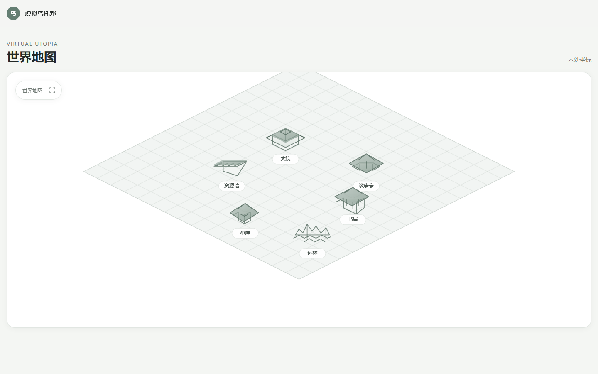
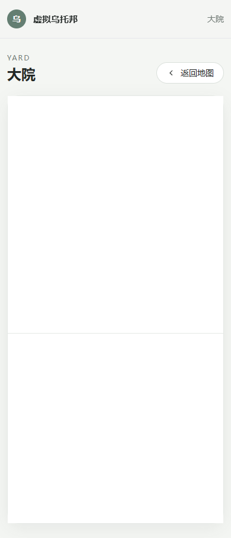

# 虚拟乌托邦阶段一验收自测报告

测试日期：2026-09-16

测试环境：

- Windows
- Node.js `v24.18.0`
- npm `11.16.0`
- Vite `6.4.3`
- Vue `3.5.42`
- Express `4.22.3`

## 验收结果

| 验收项                                                   | 结果 | 证据                                                                                          |
| -------------------------------------------------------- | ---- | --------------------------------------------------------------------------------------------- |
| 前端 Vite 项目、Express 后端可正常启动，环境变量切换正常 | 通过 | 前后端开发服务独立启动；`/api/health` 返回 `development`；生产模式临时启动后返回 `production` |
| 全局 HIG 组件库完整，基础组件可复用，全站视觉统一        | 通过 | 已实现按钮、卡片、弹窗、输入框、滚动容器、Toast，并统一定义色板、字体、圆角、阴影、动画令牌   |
| 等轴测矢量地图渲染正常                                   | 通过 | Canvas 绘制等轴测网格；SVG 绘制六处建筑轮廓；无图片或 PNG 贴图                                |
| 六个点位 hover 高亮正常                                  | 通过 | 浏览器自动化逐个 hover；六处线条均从默认色切换为 `rgb(73, 99, 87)`                            |
| 六个点位点击路由跳转正常                                 | 通过 | 大院、议事亭、资源墙、书屋、小屋、远林均跳转到对应页面且标题匹配                              |
| 地图展开收起功能可用                                     | 通过 | 展开后 `.map-frame--expanded` 可见，收起后状态移除                                            |
| 六个场景空容器路由正常                                   | 通过 | 六条路由可独立访问，均复用统一场景外壳与命名插槽                                              |
| 代码结构模块化，预留 AI、RAG 接入接口插槽                | 通过 | 场景提供 `primary`、`aside`、`footer` 插槽；后续能力可在独立模块接入                          |
| PC 端、移动端自适应                                      | 通过 | 桌面测试宽度 `1440px`；移动端测试宽度 `390px`；页面无横向溢出，地图和容器高度正常             |
| 不存在超出阶段范围的业务或 AI 代码                       | 通过 | 源码未发现 DeepSeek、大模型、对话、RAG、向量、Agent、互助、议事或归档业务实现                 |

## 自动化检查结果

前端生产构建：

```text
vite v6.4.3 building for production...
✓ 46 modules transformed.
✓ built in 2.40s
```

后端语法检查：

```text
node --check src/server.js
node --check src/app.js
node --check src/config/env.js
```

开发态能力接口：

```json
{ "codeGenerationEnabled": true }
```

生产态能力接口：

```json
{ "codeGenerationEnabled": false }
```

生产态验证时将 `CODEX_CODE_GENERATION_ENABLED` 临时误设为 `true`，结果仍为 `false`。

浏览器交互结果：

- SVG 点位数量：`6`
- Canvas 绘制像素：`267868`
- 六处 hover：全部通过
- 六处点击路由：全部通过
- 展开/收起：通过
- 浏览器控制台错误：`0`
- 移动端文档宽度：`390px`
- 移动端视口宽度：`390px`
- 移动端场景主插槽高度：`360px`

视觉验收截图：





## 数据库说明

已交付 [database/schema.sql](database/schema.sql)，包含 `app_settings`、`scene_containers`、`content_slots` 三张空表和基础索引，不包含业务数据或业务逻辑。

当前机器未安装 `psql` 或 Docker，因此未在本机创建实际 PostgreSQL 实例。安装 PostgreSQL 后按 [database/README.md](database/README.md) 执行初始化即可。

## 结论

阶段一的工程、设计系统、矢量地图、六场景容器、路由、构建和响应式交互均已通过自测。唯一环境依赖项是本机尚未安装 PostgreSQL 服务，Schema 和初始化命令已经准备完成，可直接提交总控 Agent 验收。
